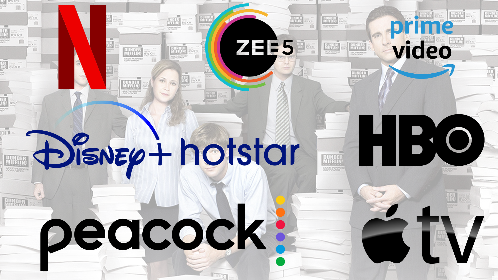

# Algorithmic Problem Solving Portfolio

## 📘 Course Information

- **Course Name:** Algorithmic Problem Solving
- **Course Code:** 23ECSE309
- **Name:** Karthik Jodangi
- **University:** KLE Technological University, Hubballi-31

## 📝 Overview

This portfolio explores the functionalities of Over-The-Top (OTT) platforms, analyzing existing features and proposing new functionalities to enhance user experience and operational efficiency. The document covers market analysis, business use cases, potential challenges, suitable algorithms, and performance analysis.

## 📑 Table of Contents

1. [Introduction](#introduction)
2. [Business Cases](#business-cases)
   - [Existing Functionalities](#existing-functionalities)
   - [Proposed Functionalities](#proposed-functionalities)
   - [Detailed Business Use Cases](#detailed-business-use-cases)
3. [Performance Analysis](#performance-analysis)
4. [Presentation](#presentation)
5. [References](#references)

## 📊 Introduction

### Market Analysis

OTT platforms have significantly transformed the content consumption landscape. The global OTT market, valued at USD 121.61 billion in 2021, is projected to grow at a CAGR of 29.4% from 2022 to 2030. Major players include Netflix, Amazon Prime Video, Hulu, and Disney+. The growth is driven by increasing internet penetration and the adoption of smart devices.

### Objectives

- Identify and analyze existing OTT platform functionalities.
- Propose new functionalities to enhance the domain.
- Explore business use cases, challenges, and benefits.
- Suggest suitable algorithms and design techniques.

## 💼 Business Cases

### Existing Functionalities

1. 📺 Content Streaming
2. 🔄 Personalized Recommendations
3. 📱 Multiple Device Compatibility
4. 📥 Offline Viewing
5. 📂 Content Categorization
6. 👤 User Profiles
7. 📜 Content Licensing and Rights Management
8. 💰 Content Monetization
9. 🌐 Content Delivery Network
10. 🗣 Social Integration

### Proposed Functionalities

1. 🔍 Content Discovery Tools
   - Advanced Filtering Options
   - Personalized Playlists
   - Mood-Based Recommendations
2. 🛡 Measures Against Piracy and Unauthorized Access
3. 🕶 AR and VR Technologies
4. 👥 Social Viewing Experiences
   - Virtual Watch Parties
   - Real-time Chat
5. 🎯 Personalized Advertising
6. 🏠 Integration with Smart Home Devices
7. 🌎 Content Localization
   - Volume Adjustment for BGM, Voice, and Songs
   - Multi-language Support
   - AI-generated Subtitles and Dubbing
8. 📊 Interactive Content
   - Quizzes, Polls, etc.

### Detailed Business Use Cases

1. **Advanced Filtering Options**
   - **Challenge:** Efficiently filtering a large dataset of content.
   - **Algorithm:** Inverted indexing and TF-IDF.
   - **Design:** Multi-filter search bar.

2. **Personalized Playlists**
   - **Challenge:** Creating playlists based on user preferences.
   - **Algorithm:** Collaborative or content-based filtering.
   - **Design:** Dynamic recommendation engine.

3. **Mood-Based Recommendations**
   - **Challenge:** Accurately identifying user mood.
   - **Algorithm:** Sentiment analysis using NLP techniques.
   - **Design:** Integration with user interaction data.

4. **Measures Against Piracy**
   - **Challenge:** Preventing unauthorized access and distribution.
   - **Algorithm:** Watermarking and encryption.
   - **Design:** DRM solutions.

5. **AR and VR Technologies**
   - **Challenge:** Creating immersive content experiences.
   - **Algorithm:** 3D rendering and real-time processing.
   - **Design:** VR apps compatible with OTT platforms.

6. **Social Viewing Experiences**
   - **Challenge:** Synchronizing content playback for multiple users.
   - **Algorithm:** Network synchronization protocols.
   - **Design:** Virtual watch party feature.

7. **Personalized Advertising**
   - **Challenge:** Targeting ads effectively without intruding on user experience.
   - **Algorithm:** Machine learning algorithms for ad targeting.
   - **Design:** Dynamic ad placement.

8. **Integration with Smart Home Devices**
   - **Challenge:** Seamlessly connecting with smart home ecosystems.
   - **Algorithm:** IoT protocols and standards.
   - **Design:** Voice command integration.

9. **Content Localization**
   - **Challenge:** Adapting content for various languages and regions.
   - **Algorithm:** NLP for translation and dubbing.
   - **Design:** Multi-language support with AI-generated subtitles.

10. **Interactive Content**
    - **Challenge:** Enhancing user engagement through interactive features.
    - **Algorithm:** Event-driven programming for real-time interactions.
    - **Design:** Features like quizzes and polls integrated into content.
<!--
## 📈 Performance Analysis

### Algorithm Complexity

- **Advanced Filtering Options:** O(N log N) for sorting, O(1) for querying.
- **Personalized Playlists:** O(N^2) for training, O(N) for prediction.
- **Mood-Based Recommendations:** O(N) for sentiment processing.
- **Measures Against Piracy:** O(N) for encryption/decryption.
- **AR and VR Technologies:** O(N^2) to O(N^3) for 3D rendering.
- **Social Viewing Experiences:** O(N) for synchronization.
- **Personalized Advertising:** O(N log N) for training, O(1) for prediction.
- **Integration with Smart Home Devices:** O(1) for communication.
- **Content Localization:** O(N) per sentence for NLP.
- **Interactive Content:** O(1) for event handling.
-->
## 📚 References

